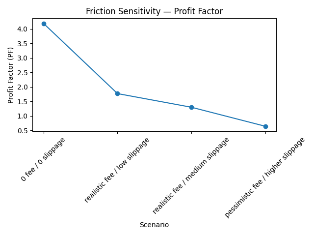
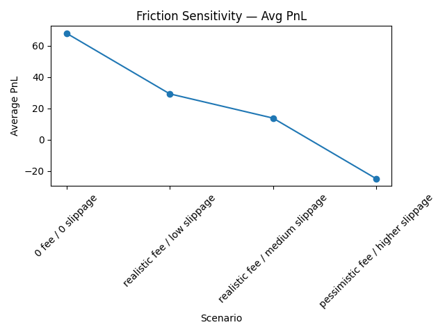
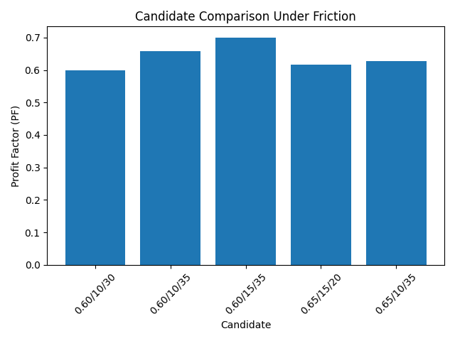

# LVN Auction Backtest — Friction Review

## Overview

This project evaluates a mean-reversion strategy based on Auction Market Theory, specifically targeting reactions from Low Volume Nodes (LVNs) back toward the developing Point of Control (POC).

The system combines:

- 1H timeframe for structural context (volume profile, LVNs, value area)
- 15m timeframe for execution (entry, stop, and exit logic)

---

## Research Goal

To determine whether LVN → POC reactions provide a **robust and execution-viable trading edge**.

---

## Key Result

- Strong performance under ideal (zero-friction) conditions
- Significant degradation under realistic fee and slippage assumptions
- No candidate remained profitable under moderate-to-high friction

---

## Conclusion

The strategy is **not production-ready** in its current form.

However, the research produced valuable insights into:

- Value-area containment as a contextual filter
- LVN significance in auction behavior
- Execution sensitivity of mean-reversion strategies

These insights are now being integrated into **Telegram-based signal systems** as contextual filters rather than standalone trade logic.

---

## Structure

- `methodology.md` → how the research was conducted  
- `findings.md` → detailed results and conclusions  
- `results/` → exported backtest and friction analysis outputs  
- `figures/` → visual summaries (optional)

---

## Key Visuals

### Friction Sensitivity — Profit Factor

### Friction Sensitivity — Average PnL

### Candidate Comparison Under Friction

## Status

**Completed (Not production-ready)**

Further work is focused on integrating validated components into broader systems.
